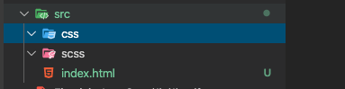
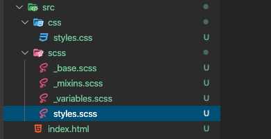
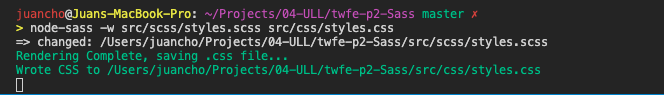
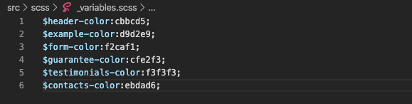
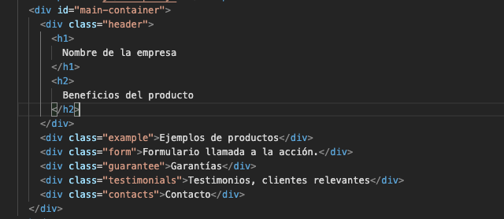
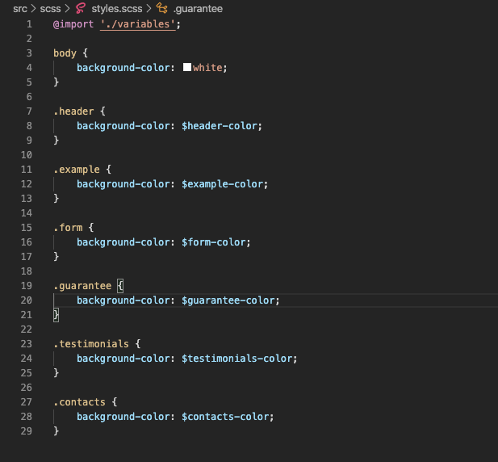
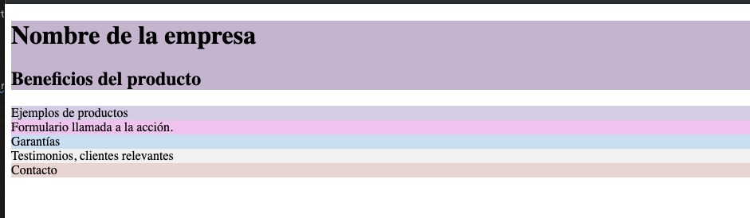

Por: Juan Barroso - alu0101266176

# Practica 2: Sass

## Objetivos

El objetivo de esta practica sera construir una **_Landing page_** a partir de un **Mockup** en la que vamos a implementar diferentes estrategias de modularización haciendo uso del preprocesador **Sass**.

Antes todo debemos tener presente algunas ventajas de usar un preprocesador de css:

    1. Extiende el lenguaje de hojas de estilo CSS o sea es un lenguaje de programación. a diferencia de css que no lo es.
    2. Características para especificar estilos de forma modular.
    3. Reduce la duplicación de código css.
    4. CSS más limpio y facilita el mantenimiento.
    5. Modularization

### Mockup:

### Tareas técnicas

#### 1. Modularizar el codigo SASS

- Modulo para las variables: \_variables.scss
- Modulo para mezclar: \_mixins.scss
- Modulo para el código en común: \_base.scss

#### 2. Anidar estilos

- Estilos de los botones de form.
- Estilo especifico en el hover.
- Estilo de los elementos dentro del form. (Deben resaltar cuando el puntero este sobre ellos).

#### 3. Reutilizar estilos

- Estilo del "encabezado" en "testimonios" con un cambio de color de texto.
- Estilo de Materialize. (Sin incluir todos los estilos).

### Trabajando con Sass.

En primer lugar vamos a crear un "proyecto" donde podamos contar con Sass como preprocesador y que ademas nos permita transpilar código .scss a .css de esta manera podremos visualizar los estilo en un navegador.

Para eso vamos a crear un `index.html`, y dos directorios nuevos que los llamaremos `css` y `scss` dentro de `src`.

Dentro de `scss` vamos a crear los módulos \_variables.scss, \_mixing.scss y \_base.scss

> NOTA: Existen módulos que nos interesa que sean transpilados indirectamente. El guion bajo "\_" se le añade a los módulos para que cuando el transpilador de node para sass mira sobre el directorio y detecta que existen ficheros con "\_Name.scss" simplemente los descarta.

Después de instalar node-sass (Sass tiene diferentes formas de instalación) ejecutamos el comando `node-sass -w src/scss/styles.scss src/css/styles.css`

Esto transpilará el modulo principal `scss` a `css` que luego será aplicado al fichero html.

### Añadiendo variables

Como ante lo comentamos una de las ventajas es que Sass como "Lenguaje de programación" permite la creación de **variables** por esto vamos a añadir el valor/código de los colores en el modulo variables. como asi también todos los valores que necesitaremos que estén centralizados.

Una vez tenemos las variables declaradas, vamos a crear los elementos donde queremos aplicar estos valores (colors).

Y por ultimo creamos en styles.scss las clases de cada elemento e importamos el modulo de variables en este modulo "general".

Con esto después de guardar los cambios se generara el código css necesario para que los elementos se pinten de esta manera:

> NOTA: de esta misma forma vamos a añadir el resto de estilos para los margenes y tamaño de los containes.
