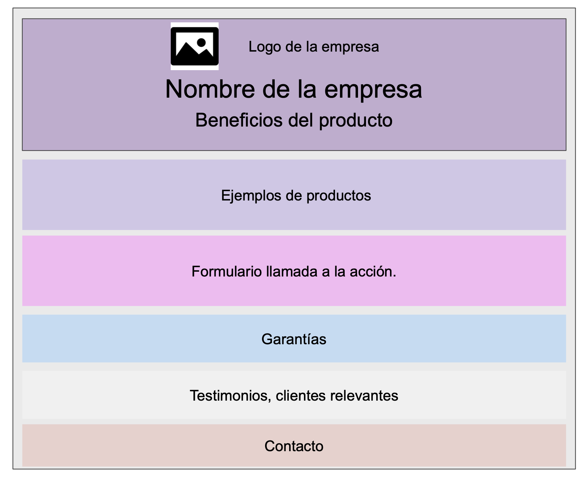

Por: Juan Barroso - alu0101266176

# Practica 2: Sass

## Objetivos

El objetivo de esta practica sera construir una **_Landing page_** a partir de un **Mockup** en la que vamos a implementar diferentes estrategias de modularización haciendo uso del preprocesador **Sass**.

Antes todo debemos tener presente algunas ventajas de usar un preprocesador de css:

    1. Extiende el lenguaje de hojas de estilo CSS.
    2. Características para especificar estilos de forma modular.
    3. Reduce la duplicación de código css.
    4. CSS más limpio y facilita el mantenimiento.

### Mockup:

### Tareas técnicas

#### 1. Modularizar el codigo SASS

- Modulo para las variables: \_variables.scss
- Modulo para mezclar: \_mixins.scss
- Modulo para el código en común: \_base.scss

#### 2. Anidar estilos

- Estilos de los botones de form.
- Estilo especifico en el hover.
- Estilo de los elementos dentro del form. (Deben resaltar cuando el puntero este sobre ellos).

#### 3. Reutilizar estilos

- Estilo del "encabezado" en "testimonios" con un cambio de color de texto.
- Estilo de Materialize. (Sin incluir todos los estilos).

### Creando un proyecto Sass.

En primer lugar vamos a crear un proyecto donde podamos contar con Sass como preprocesador y que ademas nos permita transpilar código .scss a .css de esta manera podremos visualizar los estilo en un navegador.
